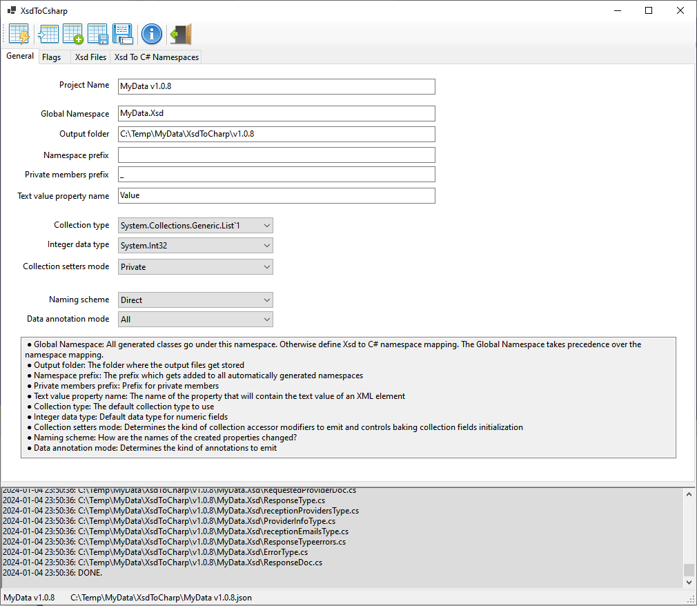
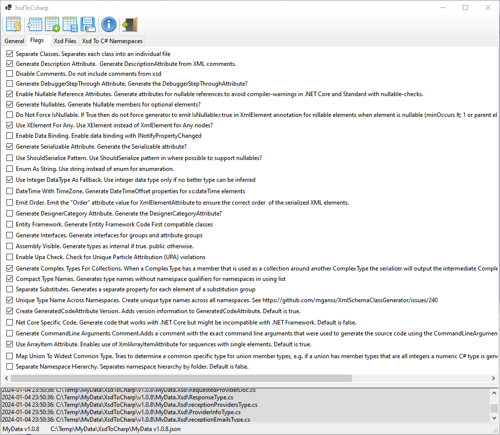
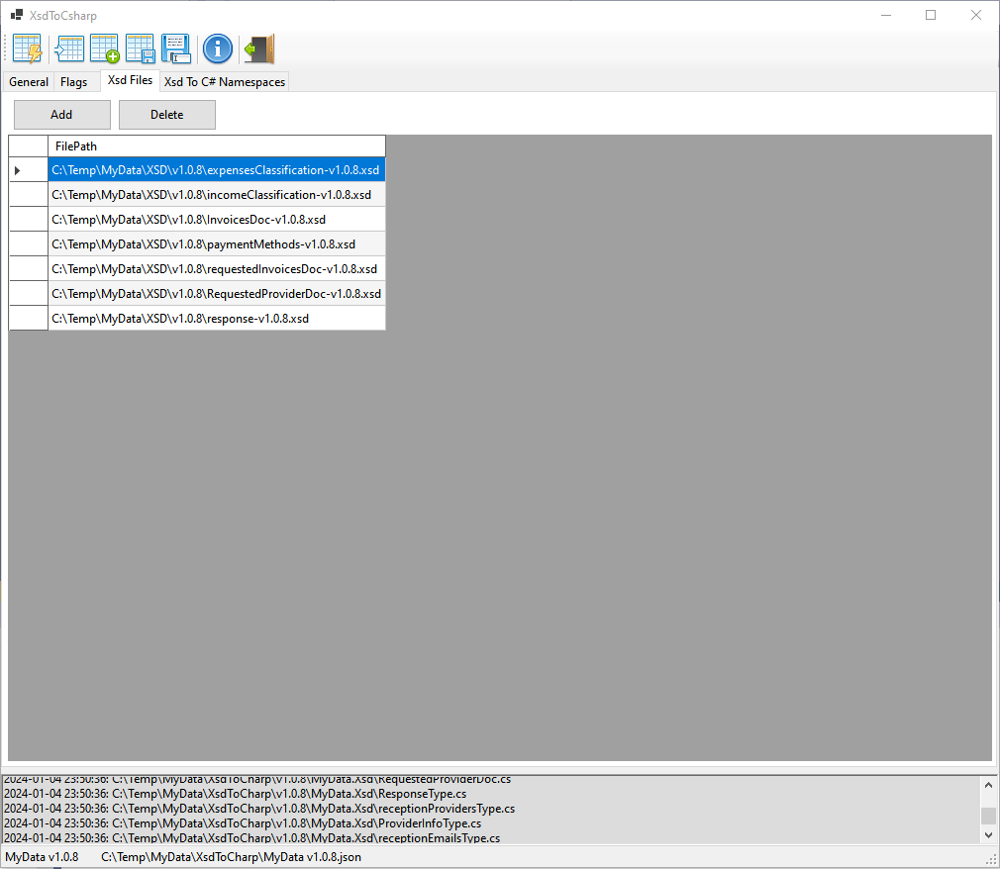



# XsdToCharp

A desktop application over the excellent [XmlSchemaClassGenerator](https://github.com/mganss/XmlSchemaClassGenerator) library.

**XsdToCharp** generates C# classes from XSD files, using the [XmlSchemaClassGenerator](https://github.com/mganss/XmlSchemaClassGenerator) library.

## XmlSchemaClassGenerator
This application uses a slightly modified version of XmlSchemaClassGenerator library, just to cover my own needs.

The source code of the modified version of the XmlSchemaClassGenerator library is included in the source of this application.

## Screenshots

